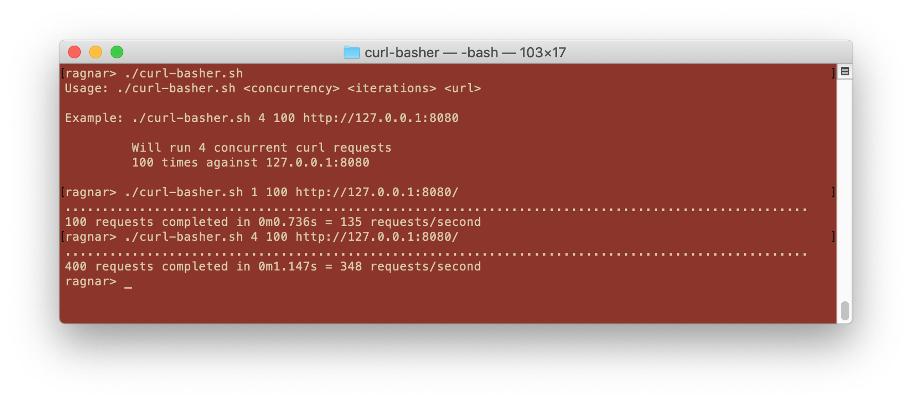

# curl-basher

A fantastic load testing tool built on curl and bash! I guess you could call
it an MVP, although it is so very M that the V is kind of questionable.

It was built after I got annoyed when benchmarking existing open-source load
testing tools and found that some tools just perform horribly. What's the
point, I thought, of building these load testing tools using a "real" 
programming language, only to have it perform like a shell script?

The next thought was: would a shell script actually be faster?

